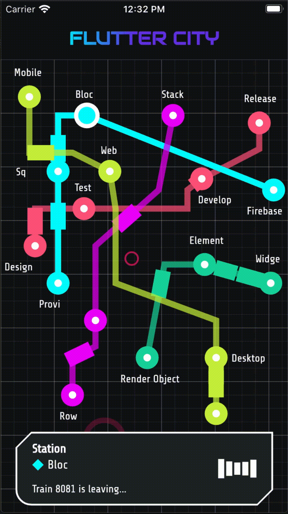

# Flutter City

A Flutter project for the Hackathon 2020.

## Pitch

Metro animation for the Flutter City. Dive into the colorful city watching the busy trains come and go.

## Description

We wanted to experiment with the combination of dynamically generated widgets and canvas shapes, all animated in real time. The project was created using a mix of a Stack with randomly spawned widgets and a Custom Painter which handles the painting of all the metro lines, stops and trains. The painting logic involves some math to calculate the train rotations and positions each frame. We created a custom shape called Cyber. We used google_fonts, flutter_spinkit and animated_text_kit. Enjoy!
